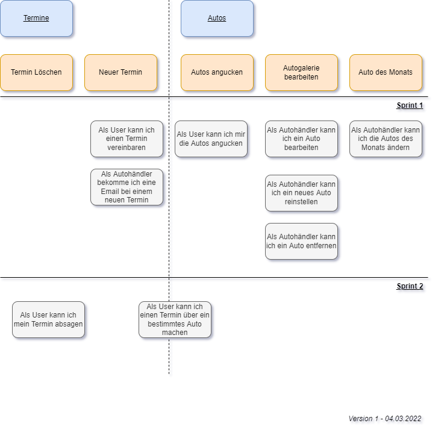

# Einführung und Ziele

**Das Ziel ist es Website zu bauen für Corner Automobile.**

Diese Website soll zum einen den Export und Import Dienst für Autos bereitstellen,  
aber auch zu anderen ein Autoverkauf darstellen. Es könnte gezeigt   
werden welches gerade das "Auto des Monats" ist d.h ein Auto welches gerade  
ein Rabatt hat.  
Dabei soll nicht von der Website direkt das Auto gekauft werden, sondern  
nur der Kontakt zu dem Händelt übermittelt werden. Details von dem Auto  
werden aber darstellt.

## Aufgabenstellung

### Was oder wer ist Corner Automobile?

- Das ist ein Autohändler für Export und Import in Hamburg

Die Aufgabe ist es diese Firma etwas mehr online Präsenz zu geben durch eine  
eine Website und somit mehr Kunden drauf aufmerksam zu machen.

## Qualitätsziele

*Priorität nach Reihenfolge (oben das wichtigste | unten weniger wichtig)*

| Qualitätsziel | Erklärung |
| ----------- | ----------- |
| Anpassbares Benutzer   Schnittstelle | Die Website sollte in er Lage sein sowohl auf dem   Smartphone, sowie auf dem Computer einwandfrei alle   Elemente[^element] richtig anzuzeigen.| 
| Zeitgerechtes Design                    | Das Design sollte minimalistisch sein und die wichtigsten   Elemente[^element] bestmöglichst darstellen. |
| Performante Website                      | Die Website sollte nicht lange Laden müssen bis Inhalte   angezeigt werden|

[^element]: Beispielsweise ein Text, ein Bild bzw. Sachen die Informationen darstellen.

## Stakeholder

| Rolle | Kontakt | Erwartungshalung |
| ----------- | ----------- | -----------|
|Kunde|Muhammed|Entwicklung einer funktionierenden Website   für Corner Automobile.
|Entwickler|Hüseyin Akkiran   <hueschromo@gmail.com>| Erfolgreich eine Website mit dem Flutter   Framework programmieren.

# Randbedingungen

### Technische Randbedingungen

| Randbedingung | Erklärung, Hintergrund |
| ----------- | ----------- |
|Flutter Framework| Der Hintergrund,für den Entwickler   ist in Flutter besser und sicherer zu werden.|
|Github| Github dient zur Versionierung des Projekts.|
|Datenbank|Dort werden die Autos gespeichert, welche  der Händler anbieten möchte.|

### Organisatorische Randbedingungen

| Randbedingung | Erklärung, Hintergrund |
| ----------- | ----------- |
|Prozess Model| Es wird ein agiler Ansatz gewählt,   da es im Kundengespräch immer mal wieder   zu Änderungen kommen kann.|
|Zeit|Es gibt keine Zeitangaben von dem Kunden,   jedoch beginnt das Semester von dem Entwickler bald.|

# Kontextabgrenzung

### Fachlicher Kontext

### Technischer Kontext
